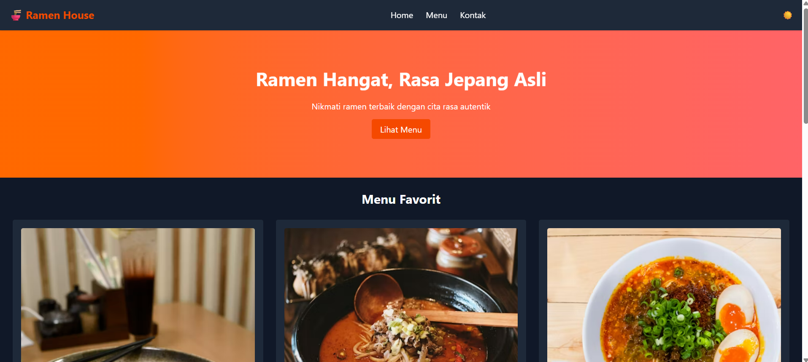

# Project Tugas Modul 5

Website modern berbasis Vite + Tailwind CSS v4.

## Tech Stack
- **Vite** - Frontend build tool yang cepat
- **Tailwind CSS v4** - Utility-first CSS framework
- **Vanilla JavaScript** - JavaScript tanpa framework

## Fitur
- ⚡ Development server dengan Hot Module Replacement (HMR)
- 🎨 Styling dengan Tailwind CSS v4
- 📦 Optimized production build
- 🎯 Vanilla JS untuk interaktivitas

## Instalasi

Clone repository dan install dependencies:

```bash
npm install
```

## Cara Menjalankan

### Development Server
Jalankan development server dengan HMR:

```bash
npm run dev
```

Server akan berjalan di `http://localhost:5173`

### Production Build
Build aplikasi untuk production:

```bash
npm run build
```

Output akan tersimpan di folder `dist/`

### Preview Build
Preview production build secara lokal:

```bash
npm run preview
```

## Struktur Folder

```
src/
├── main.js           # Entry point aplikasi
├── counter.js        # Contoh module
├── style.css         # Tailwind CSS
└── assets/           # Static assets
public/               # Public assets
```

## Deployment

Folder `dist/` hasil build siap untuk di-deploy ke:
- Netlify
- Vercel
- GitHub Pages
- Server statis lainnya

## Screenshoot
LIGHT MODE


DARK MODE
